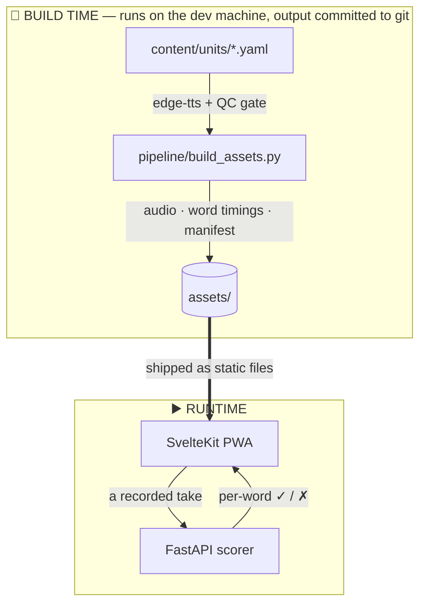

# Ortholingo ☦

**Learn the Greek of the Divine Liturgy.**
*Aprenda o grego da Divina Liturgia.*

A Duolingo-style app for learning liturgical (Koine) Greek — focused, fast, and faithful to how Greek is actually pronounced and prayed in the Orthodox Church.

Built by a catechumen, for catechumens and converts: instead of "general Greek from zero" (years), Ortholingo teaches exactly the Greek you hear and say at the Divine Liturgy — the people's responses, the Trisagion, the Creed, the Our Father — with meaning, liturgical context, and pronunciation practice.

> …θυσίαν ζώσαν, αγίαν, ευάρεστον τω Θεώ, την λογικήν λατρείαν υμών. (Rm 12:1)

*The app itself teaches in Brazilian Portuguese, for its first learners — Orthodox catechumens and converts in Brazil. Portuguese is the app's first teaching language exactly as Greek is its first target language: a starting point, not a ceiling.*

## Why this exists

- **Everything in one place, one step at a time.** Instead of piecing the Liturgy's Greek together yourself — a prayer text here, a chant recording there, a transliteration in a third place — Ortholingo walks you through the passages, prayers, and hymns on one guided, Duolingo-style path: read each phrase, hear it, say it, and keep it.
- **Byzantine pronunciation, always.** Liturgical Greek is pronounced the Modern Greek way in church — never the classroom "Erasmian" way. Every audio asset and every pronunciation check in this project follows the pronunciation you'll actually hear on Sunday.
- **A closed corpus, hand-curated.** The Liturgy is a fixed text. Every phrase is curated in versioned YAML with source citations. Content is written to be reviewable (and, God willing, blessed) by clergy.
- **Learn to *participate*, not just translate.** The goal metric is "how much of this Sunday's Liturgy did you understand?"

## Features (building toward)

- 🔤 Unit path from the **narthex** (alphabet, Byzantine reading rules) into the **nave** (responses, prayers, Creed)
- 🎵 **Liturgical karaoke**: word-by-word highlighting synced to audio, in Greek script and transliteration together; tap any word to hear it alone
- 🎙 **Pronunciation feedback**: speak a phrase, get per-word scoring (Whisper-based, Byzantine-pronunciation-aware)
- 🐢 **Slow mode**: natively slow-generated audio (−40%), not robotic time-stretching
- 🗺 **Liturgy Map**: the order of the Divine Liturgy with every phrase you've learned lit up — "você já entende 38% da Liturgia" ("you already understand 38% of the Liturgy")
- 📅 **Sunday prep**: a 5-minute review of the responses, right before you need them
- 🧠 Spaced repetition (FSRS) with transliteration "training wheels" that fade as mastery grows
- 🐈 A monastery-cat mascot who reacts, waits patiently, and never guilt-trips

## The road ahead

> Ουκ ένι Ιουδαίος ουδέ Έλλην… πάντες γαρ υμείς εις εστέ εν Χριστώ Ιησού. (Gl 3:28)

Greek first — but the architecture is language-agnostic by design. The same
curated-corpus schema, asset pipeline, and pronunciation scoring extend
naturally to the other liturgical languages of the one Orthodox Church:
Church Slavonic, Romanian, Arabic, Georgian… One app, every tradition,
starting from the nave of a Greek parish in Brazil.

## How it works

The whole design turns on one split: **the Liturgy is a fixed text, so almost
everything can be computed ahead of time.** Audio, word timings and the lesson
manifest are built once on the dev machine and committed to git, so the app is
static files and works offline. Only *pronunciation scoring* has to happen live
— it's the one thing that depends on a voice that didn't exist yet.



| | |
|---|---|
| **`content/`** | the closed corpus — every phrase cited, `review: pending` until clergy blessing |
| **`assets/`** | phrase, word and phrase-part audio + word-boundary timings + the lesson manifest, all committed to git |
| **PWA** | precaches the whole corpus, so lessons work offline; FSRS deck, progress and streak live in `localStorage` — nothing about a learner leaves their device |
| **scorer** | stateless, two routes, no database. The recorded take is the app's *only* network call |

**Why the scorer has two tiers.** On the machine that hosts it, `small` answers
in ~1.5s but scores correct speech below the pass mark on 2 of 9 test phrases;
`large-v3-turbo` never does, but costs ~5s on every take. Crucially, every one
of `small`'s errors is a *false negative* — it never wrongly accepts a wrong
phrase. So Ortholingo runs `small` first and escalates to `turbo` only when a
take is about to be marked wrong: correct speech returns fast, and escalation
can only rescue a failing take, never break a passing one.

Measurements, including the surprise that latency barely depends on phrase
length, are in **[docs/BENCHMARK.md](docs/BENCHMARK.md)**. The path is drawn in
[docs/ARCHITECTURE.md](docs/ARCHITECTURE.md#1-system-overview).

**Why a tunnel for phone testing.** Browsers only grant microphone access in a
secure context, so `http://<lan-ip>` is refused. `./dev.sh` starts a Cloudflare
quick tunnel to hand the phone an HTTPS URL.

## Repository layout

```
content/    the curriculum — YAML phrase files with Greek, transliteration,
            Portuguese, glosses, context and source citations (priest-reviewable)
pipeline/   asset builder: text → audio (edge-tts, QC-gated) + word timings
assets/     generated audio corpus + timing JSONs (committed, app-ready)
frontend/   SvelteKit PWA
backend/    FastAPI pronunciation scoring
bakeoff/    the speech-stack laboratory: TTS/STT benchmarks that decided the stack
docs/       architecture and decision log
pictures/   mascot art
```

## Tech stack (decided by benchmark, see `bakeoff/`)

| Concern | Choice |
|---|---|
| TTS (build-time) | Microsoft neural voices via edge-tts — `el-GR-AthinaNeural` for Greek, `en-US-AvaMultilingualNeural` for the mascot; official Azure Speech free tier for production |
| Word sync | edge-tts WordBoundary events captured at generation into timing JSONs |
| STT (runtime) | faster-whisper, two-tier: `small` int8 answers fast, `large-v3-turbo` re-judges anything below the pass mark; Byzantine phonetic folding before the word-level diff — [measured here](docs/BENCHMARK.md) |
| Frontend | SvelteKit PWA — precaches the corpus, lessons work offline |
| Backend | FastAPI — stateless, no database; its only job is scoring a recorded take |
| Progress / SRS | FSRS in the browser (`localStorage`); nothing about a learner leaves their device |

## Content sources

Portuguese translations follow the *Devocional — O Livro de Orações do Cristão Ortodoxo* (Edições ECCLESIA, 2024) and context draws on *O Catecismo Ortodoxo de São Nectário de Egina* (ECCLESIA, 2023). The books themselves are **not** distributed in this repository. All curriculum content carries `review: pending` until reviewed by clergy.

---

*Ortholingo is a personal study project by an Orthodox catechumen. It is not an official publication of any parish or jurisdiction.*
